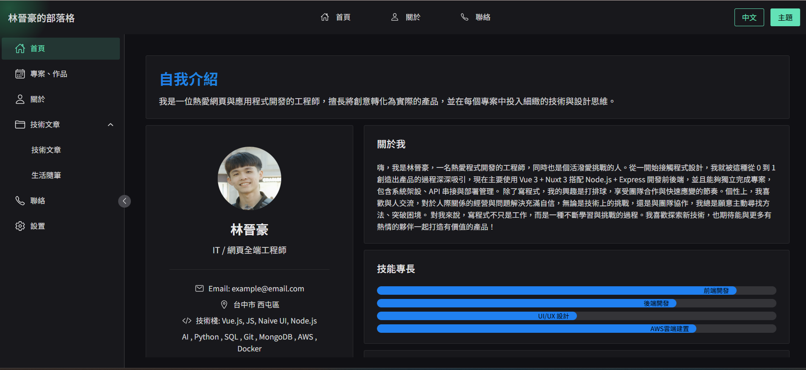
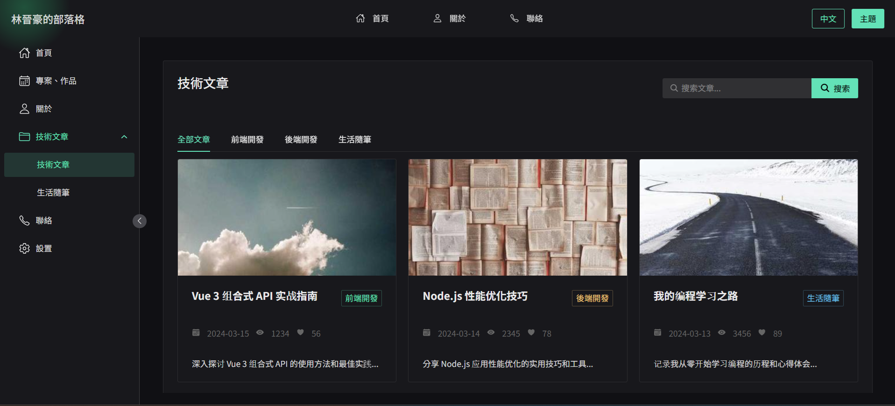

# 🚀 個人技術部落格網站

一個基於 Vue 3 + Vite + Naive UI 構建的現代化個人技術部落格網站。

## ✨ 專案特點

- 🎨 現代化的 UI 設計，使用 Naive UI 組件庫
- ⚡ 基於 Vue 3 + Vite 構建，極速開發體驗
- 📱 響應式設計，完美適配各種設備
- 📝 技術文章分類展示
- 🔍 文章搜尋功能
- 🎯 標籤分類系統

## 🛠️ 技術棧

- **前端框架**: Vue 3
- **構建工具**: Vite
- **UI 組件庫**: Naive UI
- **圖標庫**: @vicons/ionicons5
- **路由管理**: Vue Router
- **狀態管理**: Vue Composition API
- **工具庫**: @vueuse/core

## 🚀 功能特性

### 文章管理

- 文章分類展示
- 文章搜尋
- 文章詳情
- 文章標籤

### 用戶體驗

- 響應式佈局
- 平滑滾動
- 動畫效果
- 暗黑模式

## 🚀 快速開始

### 安裝依賴

```bash
npm install
```

### 開發環境運行

```bash
npm run dev
```

### 生產環境構建

```bash
npm run build
```

## 📁 專案結構

```
personal-web/
├── src/
│   ├── assets/        # 靜態資源
│   ├── components/    # 公共組件
│   ├── views/         # 頁面組件
│   ├── router/        # 路由配置
│   ├── App.vue        # 根組件
│   └── main.js        # 入口文件
├── public/            # 公共資源
└── package.json       # 專案配置
```

## 🎨 界面預覽

### 首頁



### 文章列表



## 📞 聯繫方式

- 郵箱：yy6313531@gmail.com
